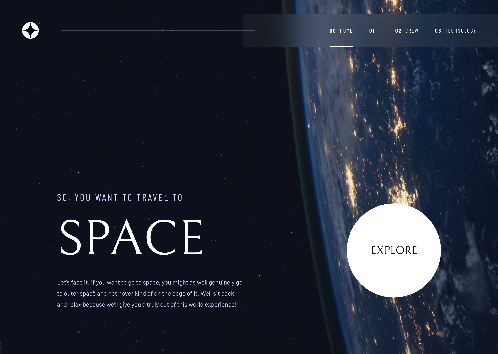

# React + Vite Project

## Space tourism multi-page website

This is a modern, responsive web experience designed to showcase the future of space travel. Inspired by cutting-edge design and built with clean, reusable code, the website allows users to explore:

🪐 Destinations – Discover planets and moons you can visit.

👨‍🚀 Crew – Meet the people who make space travel possible.

🚀 Technology – Learn about the spacecrafts and innovations behind the mission.

Every part of this project is sample code which shows how to do the following:

* View each page and be able to toggle between the tabs to see new information
* View the optimal layout for each of the website's pages depending on their device's screen size
* See hover states for all interactive elements on the page

## 📸 Screenshots

### Main Interface

### 🚀 How to install the project and run it
1. Clone the repository
2. Navigate to the project folder - cd your-repo-name
3. Install dependencies - npm install
4. Start the development server - npm run dev 

## 🔗 Links
- Solution URL (GitHub Repository): [Link]()  
- Live Site URL (Deployed App): [Link](https://github.com/abdizahir/Space-tourism-multi-page-website.git)

## 🛠️ Built With
- React – JS library
- Vite
- HTML5 & CSS3
- Tailwind
- JavaScript (ES6+)
- React Router

## Author
**Abdallah Mohammed**  
- GitHub: [github.com/your-username](https://github.com/abdizahir)   